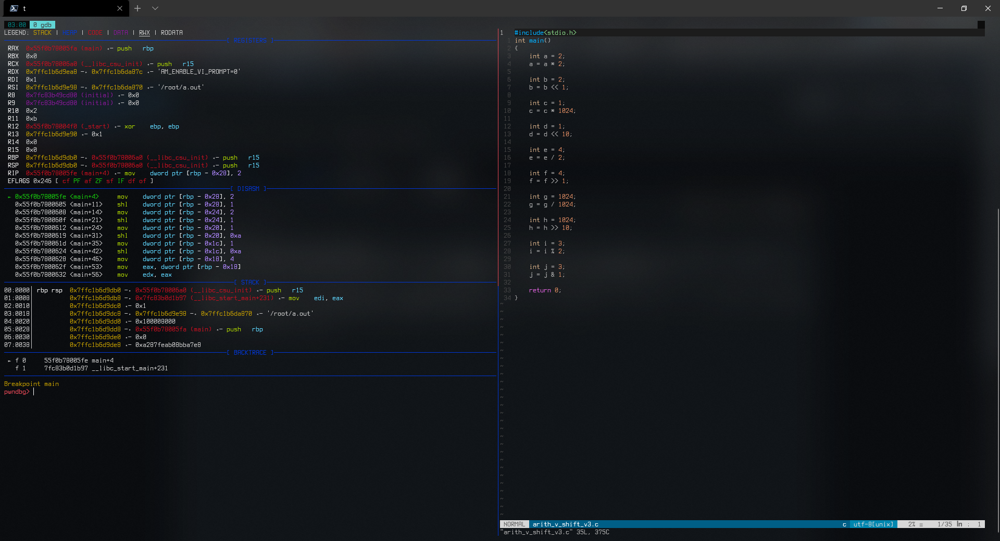

# Report. HW3.

## 과제 : 자신의 실험 결과에 대한 write-up 을 쓰세요.
사람은 어떤 학문을 이해하든지 간에 그 학문이 정말로 맞는지 확인하기 위해 자신만의 실험을 하기 마련이다. 특히 컴퓨터 공학은 그러한 실험이 많이 일어나는데 어제의 내용과 오늘의 내용을 이해하기 위해서 자신이 했던 생각이나 의문이나 고민을 write-up 에 작성하고 그 생각과 의문과 고민을 해결하기 위해서 시도했던 실험과 실험 결과를 write-up 에 작성하시오.

## 개요
알고리즘 문제를 풀 때 시간과 메모리 사용량에 제한이 들어가고, 따라서 이걸 어떻게 아끼는지가 중요하다. 지금까지 문제를 풀었을 때는 *메모리 초과*보단 *시간 초과*로 문제를 못 푼 경우가 많았다. 같은 알고리즘을 택했다고 하더라도 어떤 연산을 택했느냐에 따라 그 시간이 달라지는 것도 있을 것이다.

궁금증이 든 부분은 이렇다: **2의 제곱수에 대한 연산에 한정하여** 곱셈, 나눗셈, 나머지 *산술 연산*과 좌, 우, AND *bitwise 연산* 간의 시간 차이가 얼만큼 나는지 궁금했다.

시간 차이를 계산하기 전, 2의 제곱수를 곱하거나/나누거나, 2로 나눈 나머지를 구한다거나 할 때 어셈블리어로 어떻게 변환되는지를 알고 싶었다.



`main + 4`부터 `main + 42`까지 2줄씩, 차례대로...
  - 곱셈 연산(X 2)
  - 비트 연산(<< 1)
  - 큰 곱셈 연산(X 1024)
  - 큰(?) 비트 연산(<< 10)

...인데, 2의 제곱수를 곱해서 그런가, 그냥 `mov`와 `shl` 이 2줄씩으로만 이루어져 있다.

<details>
  <summary>`arith_v_bitwise.c`</summary>
  <p>
    
```c
#include<stdio.h>
#include<time.h>

const int target = 1048576;
const int mega = 1e6;
const int giga = 1e9;

int performance_test(int loop_count, void (*target_func)(int)){
    clock_t start = clock();
    target_func(loop_count);
    double microsecs = ((double)clock() - start);

    fprintf(stdout, "(%-10d loops) - %9.1f msec\n", loop_count, microsecs / 1000.0f);
}

void use_mul(int cnt)
{
    int n, i;
    
    for(n = 1; n <= cnt; n++)
    {
        for(i = 1; i < target; i *= 2);
    }
}

void use_mul_alt(int cnt)
{
    int n, i;

    for(n = 1; n <= cnt; n++)
    {
        for(i = 1; i < target; i *= target);
    }
}

void use_shl(int cnt)
{
    int n, i;

    for(n = 1; n <= cnt; n++)
    {
        for(i = 1; i < target; i <<= 1);
    }
}

void use_shl_alt(int cnt)
{
    int n, i;

    for(n = 1; n <= cnt; n++)
    {
        for(i = 1; i < target; i <<= 20);
    }
}

void use_div(int cnt)
{
    int n, i;

    for(n = 1; n <= cnt; n++)
    {
        for(i = target; i > 0; i /= 2);
    }
}

void use_div_alt(int cnt)
{
    int n, i;

    for(n = 1; n <= cnt; n++)
    {
        for(i = target; i > 0; i /= target);
    }
}

void use_shr(int cnt)
{
    int n, i;

    for(n = 1; n <= cnt; n++)
    {
        for(i = target; i > 0; i >>= 1);
    }
}

void use_shr_alt(int cnt)
{
    int n, i;

    for(n = 1; n <= cnt; n++)
    {
        for(i = target; i > 0; i >>= 20);
    }
}

void use_mod(int cnt)
{
    int n, i;

    for(n = 1; n <= cnt; n++)
    {
        i = 3;
        i %= 2;
    }
}

void use_bwand(int cnt)
{
    int n, i;

    for(n = 1; n <= cnt; n++)
    {
        i = 3;
        i &= 1;
    }
}


int main()
{
    clock_t start;
    double us;

    fprintf(stdout, "starting 20 \"i * 2\"s...\n");
    performance_test(mega, use_mul);
    performance_test(giga, use_mul);

    fprintf(stdout, "\n");
    
    fprintf(stdout, "starting 20 \"i << 1\"s...\n");
    performance_test(mega, use_shl);
    performance_test(giga, use_shl);
    
    fprintf(stdout, "\n");
    fprintf(stdout, "================================================================================\n");
    

    fprintf(stdout, "starting \"i * 1048576\"s...\n");
    performance_test(mega, use_mul_alt);
    performance_test(giga, use_mul_alt);
    
    fprintf(stdout, "\n");
    
    fprintf(stdout, "starting \"i << 20\"s...\n");
    performance_test(mega, use_shl_alt);
    performance_test(giga, use_shl_alt);
    
    fprintf(stdout, "\n");
    fprintf(stdout, "================================================================================\n");


    fprintf(stdout, "starting 20 \"i / 2\"s...\n");
    performance_test(mega, use_div);
    performance_test(giga, use_div);

    fprintf(stdout, "\n");

    fprintf(stdout, "starting 20 \"i >> 1\"s...\n");
    performance_test(mega, use_shr);
    performance_test(giga, use_shr);

    fprintf(stdout, "\n");
    fprintf(stdout, "================================================================================\n");


    fprintf(stdout, "starting \"i / 1048576\"s...\n");
    performance_test(mega, use_div_alt);
    performance_test(giga, use_div_alt);

    fprintf(stdout, "\n");

    fprintf(stdout, "Starting \"i >> 20\"s...\n");
    performance_test(mega, use_shr_alt);
    performance_test(giga, use_shr_alt);

    fprintf(stdout, "\n");
    fprintf(stdout, "================================================================================\n");


    fprintf(stdout, "Starting \"i %% 2\"s...\n");
    performance_test(mega, use_mod);
    performance_test(giga, use_mod);

    fprintf(stdout, "\n");

    fprintf(stdout, "Starting \"i & 1\"s...\n");
    performance_test(mega, use_bwand);
    performance_test(giga, use_bwand);

    return 0;
}
```

  </p>
</details>

이걸 Archlinux에서 실행한 결과는 다음과 같다:


곱셈과 나눗셈의 경우 한 번의 loop에서 20번의 연산이 발생하고, 나머지의 경우 한 번의 loop에서 1번의 연산만 발생한다.
이를 고려했을 때, 나눗셈에서 산술 연산과 비트 연산 간의 시간 차이가 현저하게 나타났고(20번 * 10억 번 연산 시 5.5초 정도 시간 차이 발생), 곱셈이나 나머지에선 차이가 크게 없었다.
