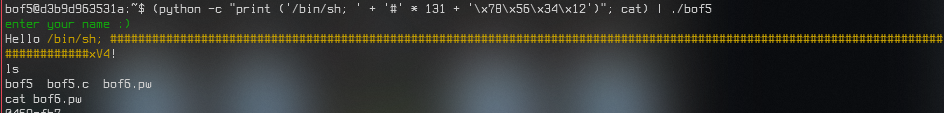

# Report. HW6.

## `bof3`, `bof4`

## `bof5`

<details><summary>`bof5.c`</summary>
<p>
    
```c
#include <stdio.h>
#include <stdlib.h>
#include <unistd.h>
#define BUF_SIZE 128
#define KEY 0x12345678
#define G "\033[32m"
#define Y "\033[33m"
#define E "\033[0m"

void vuln() {
    int innocent;
    char buf[BUF_SIZE];
    
    puts(G "enter your name :)" E);
    gets(buf);
    printf("Hello " Y "%s" E "!\n", buf);

    if (innocent == KEY) {
        if (setreuid(1006, 1006)) {
            perror("setuid");
            exit(1);
        }
        if (setregid(1006, 1006)) {
            perror("setgid");
            exit(1);
        }
        system(buf);
    }
}

int main(){
    vuln();
    return 0;
}
```

</p></details>

### 이전과의 차이점
- `bof4`는 argument로 문자열을 넘겨주었지만, 이번엔 *프로그램 내 입력*을 통하여 문자열을 넘겨주어야 한다.
- `system("/bin/sh")`을 통하여 BOF가 발생했을 경우 그 안에서 쉘을 실행하는 구문이 이번엔 `system(buf)`으로 바뀌었다. 그러니까, *입력을 통해* `/bin/sh`을 실행하여야 한다.

### 진행
그래서... 이번에도 `buf`와 `innocent` 간에 거리가 얼만큼 되는지 알아보아야 한다.

문자열을 입력받는 `gets`

    0x555555555244  <vuln+27>       lea rax, [rbp-0x90]
    0x55555555524b  <vuln+34>       mov rdi, rax
    0x55555555524e  <vuln+37>       mov eax, 0x0
    0x555555555253  <vuln+42>       call 0x5555555550f0 <gets@plt>
    
... 부분에서, `$rdi`가 가리키는 주소 `$rbp - 0x90` 주소를 찾아보니 주소값 `0x00007fffffffe400`이 나왔다. 여기가 `buf`의 시작주소일 것이다.

그리고 `innocent`와 `KEY`를 비교하는 부분

    0x555555555273  <vuln+74>       cmp DWORD PTR [rbp-0x4], 0x12345678
    
...에서 `innocent`가 있는 주소값 `$rbp - 0x4`가 가리키는 곳을 찾아보니 주소값 `0x00007fffffffe48c`가 나왔다. `buf`에서 **140** 만큼의 주소값 차이가 존재한다. 그러니까... `gets`를 통해 140글자를 입력하고 뒤에 `KEY` 값을 넣어줘야 `innocent == KEY`가 `true`가 되어 그 안에 있는 코드가 실행될 것이다.

입력할 때 앞에 "/bin/sh; "를 붙여주자(그래야 쉘이 안에서 실행된다). 그리고... 중간에 있는 내용들은 #로 채워놓자(그래야 쉘이 실행되고 아무것도 실행하지 않게 - 중간에 채워놓은 #들 때문에 주석처리가 되어 아무것도 실행을 하지 않게 - 된다. 그 다음에 `innocent`에 들어갈 비교값 `0x12345678`을 **little-endian** 방식으로 입력을 시켜주고.



성공했다. (`bof6` 비밀번호는 일부러 잘랐다)

# -- END --

