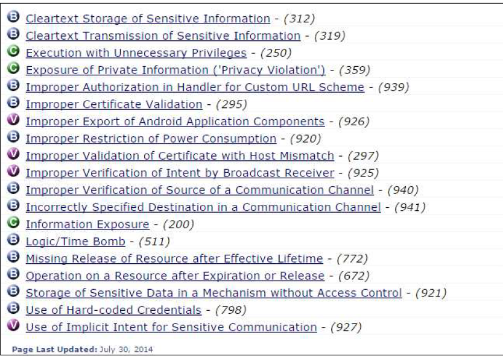

# 과제1 
1. CVE 
- cve란
    - Common Vulnerabilities and Exposure의 약자로 공개적으로 알려진 소프트웨어의 보안취약점을 가리키는 고유 표기를 뜻한다. 이는 취약점을 가진 다른 도구, 저장소 및 서비스 간에 데이터를 공유하는 것이 목표다.

- CVE 넘버를 포함한 최근 2년 안에 발생한 취약점

  - CVE 넘버 : CVE-2018-8477
    취약점 내용 : 	Windows 커널 메모리 정보 노출 취약점
    패치 일시 : ’18.12.11
    윈도우 커널이 메모리에서 객체들을 부적절하게 다룰 때 정보 노출 취약점이 발생한다.
    이 취약점을 성공적으로 착출한 공격자는 유저 시스템을 더 노출 시킬 수 있게 정보들을 더 얻을 수 있다.
---
2. 프로그램 결함
    - CWE는 Common Weakness Enumeration의 약자로 보안약점 리스트이다.
        - CWE-919
            - 모바일 어플리케이션 관련 보안약점
            
            안드로이드나 iOS에 기반을 둔 최근의 모바일 앱은 기존의 데스크톱이나 랩톱에서 구동되는 범용 운영 체제에서 제공하는 일반적인 기능들을 모바일 디바이스에서 거의 그대로 사용할 수 있다는 특징을 가지고 있다.
    
    - OWASP는 Open Web Application Security Project의 약자로  오픈소스 웹 애플리케이션 보안 프로젝트를 말한다. OWASP는 가장 큰 오픈소스 웹 애플리케이션 보안 프로젝트로 주로 웹에 관한 정보노출, 악성 파일 및 스크립트, 보안 취약점 등을 연구하며, 10대 웹 애플리케이션의 취약점(OWASP TOP 10)을 발표한다.
        - OWASP Top 10
        
        - Injection(인젝션)
            - SQL, OS, XXE(Xml eXternal Entity), LDAP 인젝션 취약점은 신뢰할 수 없는 데이터가 명령어나 쿼리문의 일부분이 인터프리터로 보내질때 발생한다. 공격자의 악의적인 데이터는 예상하지 못하는 명령을 실행하거나 적절한 권한 없이 데이터에 접근하도록 인터프리터를 속일 수 있다.
---
3. 실제 사례
    - 마커스 헤스(Markus Hess) 세계 최초의 사이버 스파이
        - 1980년 소련 연방의 스파이로 뽑힌 독일인 마커스 헤스는 미국 국방부 컴퓨터를 해킹해 기밀 정보를 훔쳐오라는 임무를 받았다. 헤스는 독일 브레멘 대학에서 네트워크를 사용해 위성 링크 및 대서양 횡단 케이블을 통해 인터넷 게이트웨이에 도달했다. 그리고 결국 약 400대의 미국 국방부 컴퓨터를 공격하는 데 성공했다. 그 중 일부는 독일 및 일본에 배치된 군사기지의 컴퓨터들이었고, 매사추세츠주 케임브리지 MIT소재의 컴퓨터와 펜타곤의 옵티미스 데이터베이스도 포함되어 있었다.
      
    - 악성코드
        
        메일로 해킹하기
        페이지의 로그인과 동일하게 페이지를 만듬
        서버에 전송하는 부분의 링크 값만 다른 곳으로 바꾸어 해킹 시도

4. 앞으로 잘 부탁드려요!!!!
 너무 기대가 됩니다~